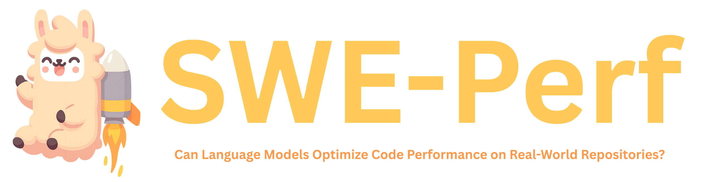

<div align="center">
  
</div>

<p align="center">
  <a href="https://swe-perf.github.io/">
    
  </a>
  <a href="https://huggingface.co/datasets/SWE-Perf/SWE-Perf">
    
  </a>
  <a href="https://arxiv.org/abs/2507.12415">
    
  </a>

</p>

---

## 🚀 What is SWE-Perf?

Optimizing code performance is paramount in software engineering, yet it remains a largely unexplored frontier for Large Language Models (LLMs). While models excel at fixing bugs, their ability to make code faster at a repository-scale is not well understood.

To address this, we introduce **SWE-Perf**, the first benchmark meticulously designed to evaluate LLMs on performance optimization tasks within genuine, complex **repository contexts**. Unlike benchmarks that focus on isolated code snippets, SWE-Perf challenges models to understand and modify **entire codebases**. The benchmark comprises **140 instances**, each derived from a real performance-improving pull request on a popular GitHub repository. For each instance, a model is provided with the full source code, the target functions, and the human expert's solution for reference. The core task is to generate a code patch that reduces the test's execution time without introducing bugs.

## 📦 Environment Setup
We recommend using Conda to manage dependencies.

To create the same environment:

```bash
conda env create -f environment.yml
```


## 📊 Evaluation Overview
Evaluation measures model-generated patch predictions on the SWE-Perf dataset to assess their performance. 
The evaluation pipeline has **two stages**:

1. **Run Evaluation** – Executes each prediction, measures runtime improvements, and stores logs.
2. **Check Evaluation** – Aggregates logs into a CSV report containing performance metrics.

See the [evaluation README](/evaluation/README.md) for detailed usage.


## 🛠️ Generation Overview

Generation covers the process of using LLMs to generate code patches that improve performance on SWE-PerF tasks. The pipeline supports both **oracle** and **realistic** settings.

### Oracle Setting

The **Oracle generation pipeline** includes the following steps:

1. **Generate Prompts** – Collect relevant source files and assemble them into prompts.
2. **Run Inference** – Feed prompts to an LLM to produce patches.
3. **Convert Outputs** – Transform model outputs into **unified diff format**.

See the [generation README](/generation/oracle/README.md) for details.

### Realistic Setting

For realistic settings, we provide implementations using different frameworks:

- **OpenHands**: [OpenHands Inference Guide](/generation/realistic/openhands/README.md)
- **Agentless**: [Agentless Inference Guide](/generation/realistic/agentless/README.md)


## 📂 Data Collection Overview

The SWE-Perf dataset is built through a **five-phase pipeline** to identify and verify real-world performance-optimizing pull requests:

1. **Collect PRs** – Crawl PRs from 12 popular GitHub repositories.
2. **Measure Performance** – Run all unit tests before/after each PR to obtain runtime data.
3. **Identify Performance PRs** – Filter PRs with significant improvements and relevant test coverage.
4. **Verify Stability** – Confirm that performance gains are consistent and reproducible.
5. **Extract Optimization Targets** – Define function-level targets for *Oracle* and *Realistic* evaluation settings.

Full details are in the [data collection README](/data_collection/README.md).

## 📚 BibTeX

If you find our work useful, please consider citing our paper:
```bibtex
@article{he2025sweperf,
    title={SWE-Perf: Can Language Models Optimize Code Performance on Real-World Repositories?},
    author={He, Xinyi and Liu, Qian and Du, Mingzhe and Yan, Lin and Fan, Zhijie and Huang, Yiming and Yuan, Zejian and Ma, Zejun},
    journal={arXiv preprint arXiv:2507.12415},
    year={2025}
}
```

## 🤝 Contact & Acknowledgements

Please reach out to `qian.liu@tiktok.com` for questions or feedback on SWE-Perf. We welcome collaborations and suggestions for improving the benchmark. This work was conducted during Xinyi and Yiming's internship at TikTok.
